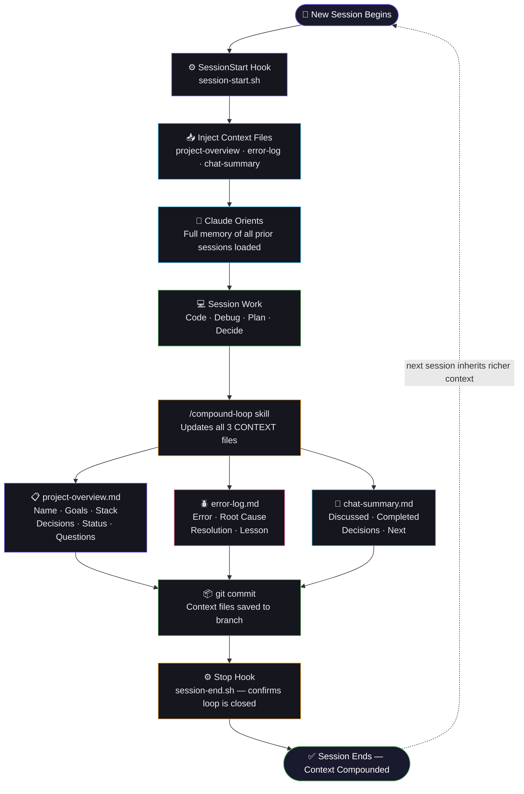
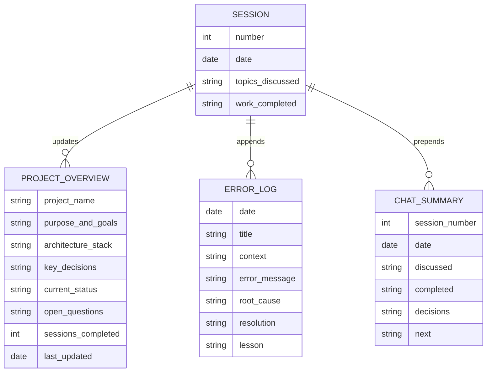
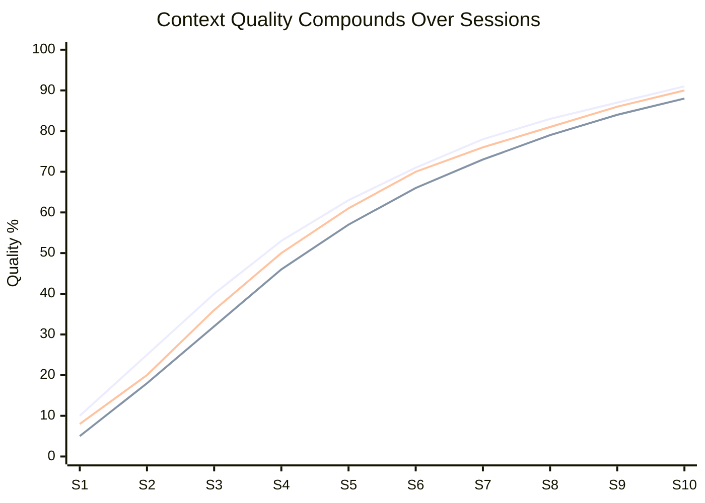
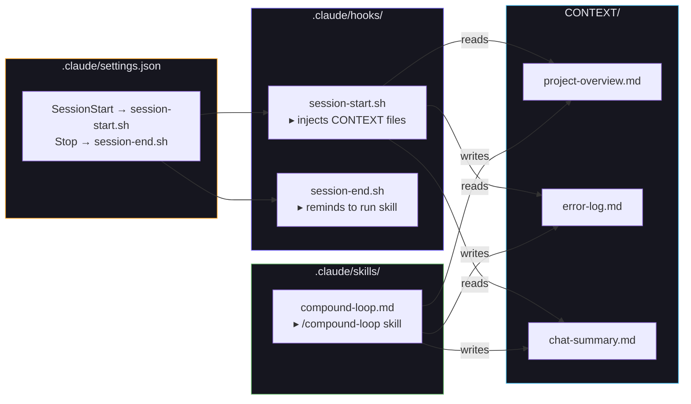
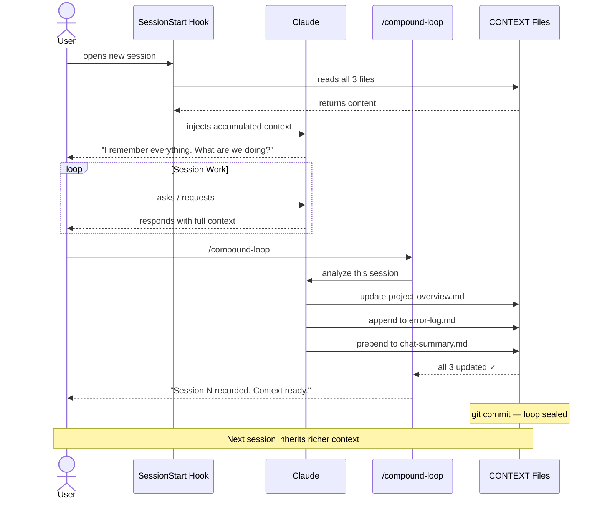

# Compound Loop — Diagrams

## 1. The Loop Cycle



---

## 2. Context Files & What They Track



---

## 3. Compound Knowledge Growth



---

## 4. File & Hook Architecture


```

---

## 5. Session Timeline (Sequence)


